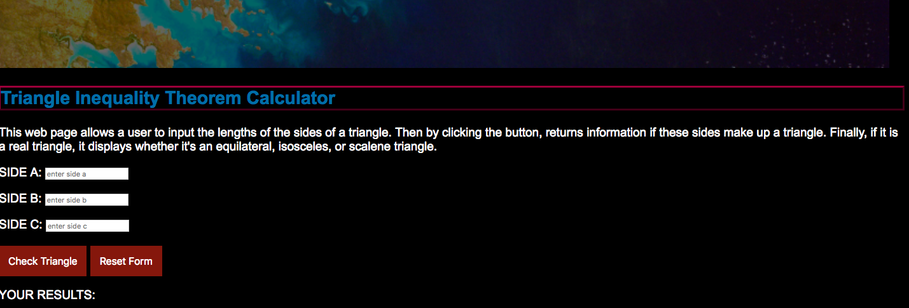
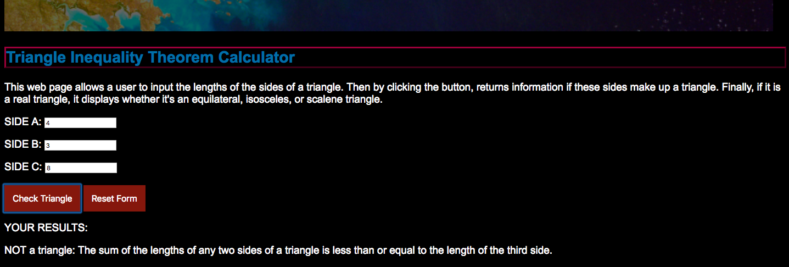
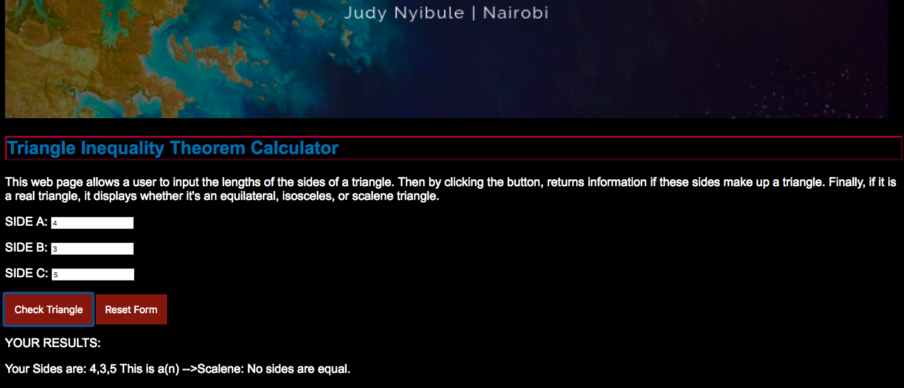
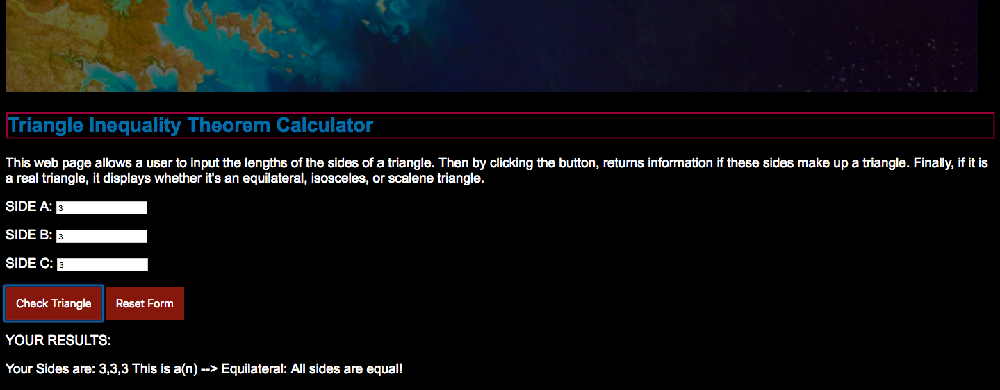

# TRIANGLE TRACKER

## Project Description and Features
The Triangle Tracker [Triangle Inequality Theorem Calculator] is: A web page that allows the user to:

  - input and capture the lengths of the sides of a triangle
  - returns whether these sides form an equilateral, isosceles, or scalene triangle
  - or if the sides cannot make a triangle at all.

The formula that decides whether the dimensions inputted make up a triangle or not is:

Side lengths that do not adhere to the triangle inequality theorem: States that the sum of the side lengths of any 2 sides of a triangle must exceed the length of the third side.

EXAMPLE of a side that will not make a triangle: 4,8,3

----
# Link to Site

Link here
(https://judynyibule.github.io/triangle/)

----
# Author
The Triangle Tracker was created by Judy Nyibule.

----
# Behavior Driven Development
## USER STORY:
1. WHAT: A form is provided on screen with 3 input bars for the 3 sides representing a triangle.
2. WHO: The user inputs 3 sides of a triangle.
2. WHAT: Once the sides have been inputed, the submit button sends the 3 arguments to a Javascript function isTriangle()  that checks [in order:]
## SCENARIO:
-Do the sides inputed constitute a real triangle?
    * IF TRUE [following the Triangle Inequality Theorem condition ] THEN a message displays to indicate it is a triangle and proceeds to display what type of triangle it is using the nested control flows.
    * IF FALSE, THEN a message displays to indicate it is NOT a triangle and program ends.

----
# Technology

* [HTML]
* [Javascript]
* [CSS]  

Triangle Tracker is an open source with a public repository on GitHub.

----
# Setup Instructions and Installation

* Download/Clone the project from GitHub
* [Preferred]: Install Atom editor to edit the code.
* Link atom to your online GitHub profile to push and commit code.
* Web Browser: Chrome

# License and Copyright

The Triangle Tracker is licensed under the terms of the MIT license and is available for free.
